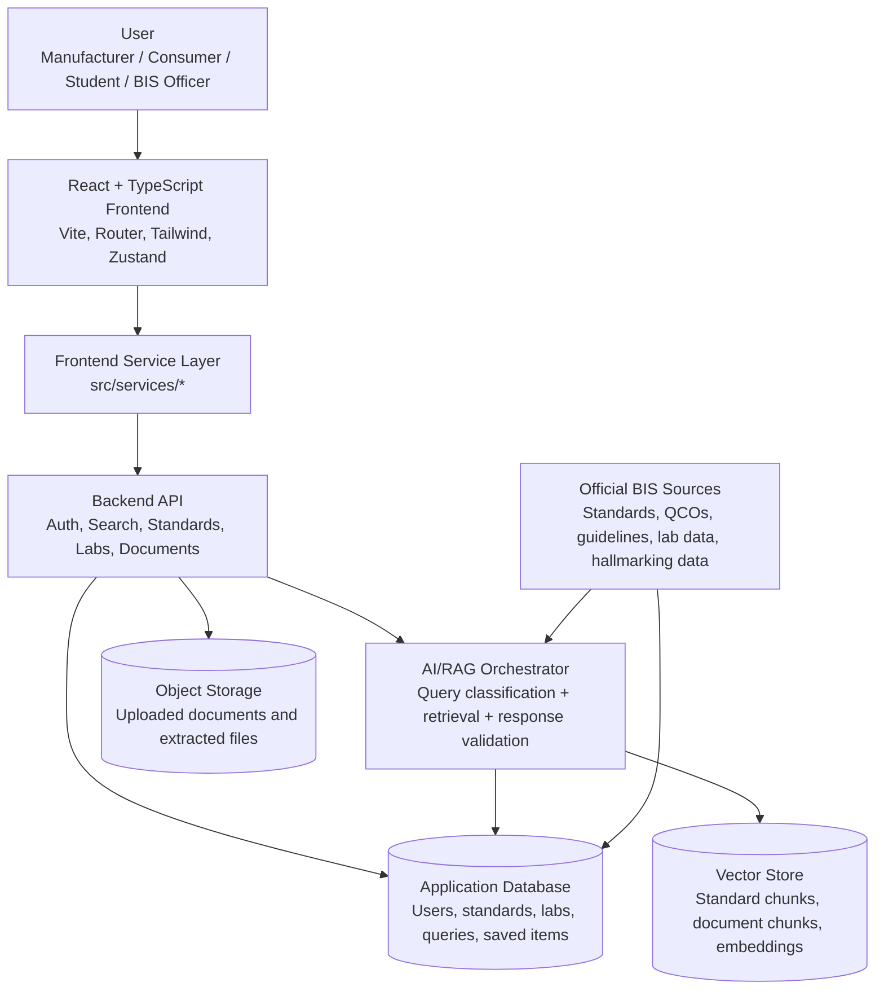
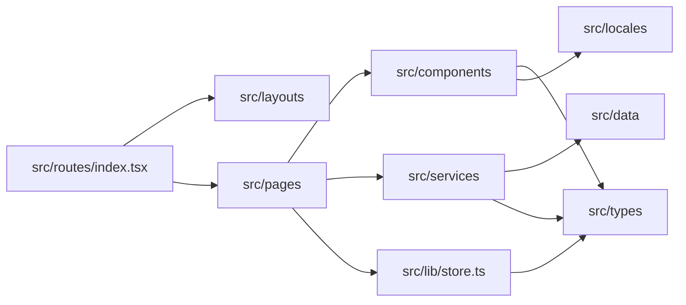
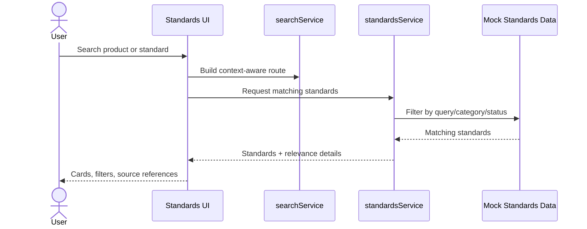
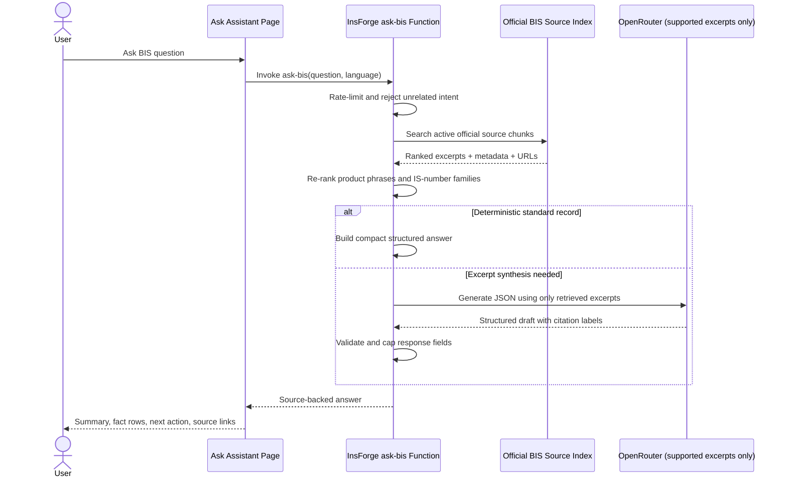
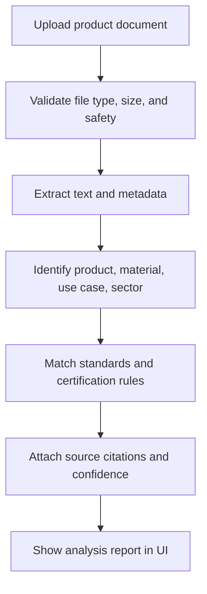
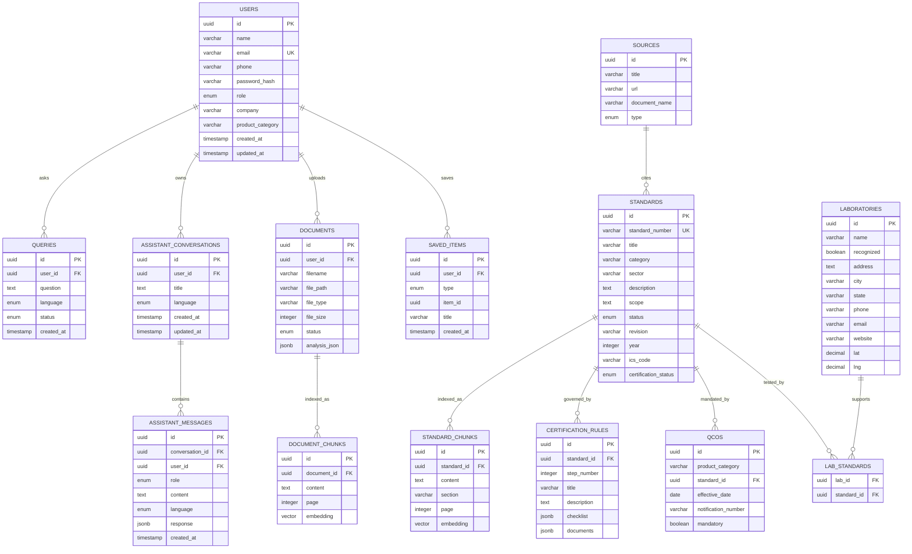
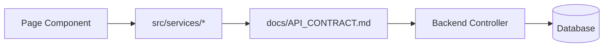
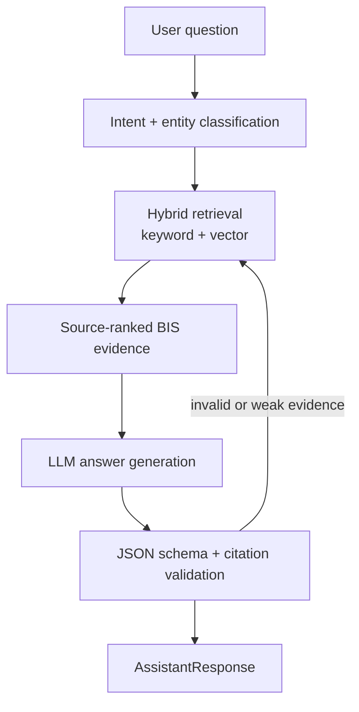

<h1 align="center">
  
  BIS SmartGuide
</h1>

<p align="center">
  AI-powered standards, certification, and BIS service guidance for Indian industries and consumers.
</p>

This repository is being built for **Smart India Hackathon problem statement SIH26107: AI-powered Intelligent Assistant for Indian Standards and BIS Services for Industries and Consumers**.

## What It Solves

Indian manufacturers, students, MSMEs, and consumers often struggle to answer basic BIS questions quickly:

- Which Indian Standard applies to my product?
- Is BIS certification mandatory or voluntary?
- Which certification scheme should I follow?
- Which documents and testing steps are required?
- Which BIS-recognized laboratories can support testing?
- How do I verify hallmarking or a HUID?

BIS SmartGuide turns these workflows into one guided product experience with standards search, certification guidance, source-backed assistant responses, laboratory discovery, document upload analysis, and Hindi/English localization.

## Core Features

- **Standards search and recommendations**: Find relevant Indian Standards by product, category, sector, and certification status.
- **Certification journey guidance**: Show mandatory/voluntary verdicts, scheme explanation, documents, checklist, official sources, and next actions.
- **AI assistant**: Official-source BIS guidance with linked citations, signed-in chat history, and new conversation support.
- **Laboratory discovery**: Search BIS-recognized laboratories by city, state, category, and supported standards.
- **Hallmarking support**: HUID verification flow for consumers and jewellers.
- **Document upload workflow**: Planned document extraction and analysis for product identification and standards mapping.
- **Saved items and query history**: User-facing workspace for standards, labs, guides, and previous questions.
- **Bilingual UX**: English and Hindi dictionaries in `src/locales/`.

## System Architecture



## Frontend Module Map



## User Workflows

### Standards Discovery



### Source-Grounded AI Assistant Flow



The indexed corpus currently includes the two supplied official BIS compulsory-marking annexures, official hallmarking/HUID guidance, live BIS LIMS records for IS 1417, and independently checked standard-revision records. Every indexed document and chunk carries provenance metadata. User-supplied prototype HUIDs, laboratories, and stale standard lists are isolated in `bis_demo_reference_records` and are never queried by the assistant.

### Planned Document Analysis Flow



## Data Model

The database design separates user data, standards knowledge, official source provenance, assistant conversations, uploaded documents, certification rules, and saved workspace items.



## Schema Design Notes

| Domain | Tables | Purpose |
| --- | --- | --- |
| Identity | `users` | Roles for manufacturer, consumer, student, and administrator journeys. |
| Standards knowledge | `standards`, `standard_chunks`, `sources` | Searchable standard metadata, source provenance, and RAG-ready chunks. |
| Certification | `qcos`, `certification_rules` | Mandatory/voluntary decisions, QCO evidence, and scheme checklists. |
| Laboratories | `laboratories`, `lab_standards` | BIS-recognized lab directory and supported testing standards. |
| Assistant | `assistant_conversations`, `assistant_messages` | Owner-isolated conversation history, structured assistant outputs, warnings, and citations. |
| Documents | `documents`, `document_chunks` | Upload processing, extracted text, analysis results, and embeddings. |
| User workspace | `saved_items` | Saved standards, labs, guides, and queries. |

See the full draft schema in `docs/DATABASE_SCHEMA.md`.

## API Boundary

The frontend must talk through `src/services/` only. This keeps the UI independent from backend implementation details and makes mock-to-real API migration controlled.



Important planned endpoints:

| Endpoint | Purpose |
| --- | --- |
| `POST /auth/login` | Authenticate user and create a session. |
| `POST /auth/register` | Register manufacturer, consumer, student, or administrator. |
| `GET /standards` | Search and filter standards. |
| `GET /standards/:id` | Read one standard with sources and requirements. |
| InsForge function `ask-bis` | Ask a source-backed BIS guidance question. |
| `GET /laboratories` | Search BIS-recognized testing labs. |
| `POST /hallmarking/verify` | Verify HUID or hallmarking details. |
| `POST /documents` | Upload a document for extraction and analysis. |
| `GET /documents/:id` | Read document analysis status and result. |
| `GET /certification/:standardId` | Get certification steps and requirements. |

See `docs/API_CONTRACT.md` and `docs/AI_CONTRACT.md` for request and response structures.

## AI/RAG Design Principles

- Every factual claim should be backed by a source citation.
- The assistant returns a compact title, summary, fact rows, next actions, warnings, and clickable sources instead of loose text.
- If evidence is missing or ambiguous, the system should say so instead of guessing.
- LLM API keys must never be exposed in the frontend.
- The frontend should render warnings and source links clearly.
- Only indexed URLs on `bis.gov.in` and its subdomains are eligible as answer evidence.
- Prototype/demo HUID, laboratory, and business records remain visibly labeled and outside the official retrieval path.



## Security And Public Repository Rules

This project is intended to be public for SIH review, so the repository must stay clean.

- Do not commit `.env`, `.env.*`, API keys, service credentials, private datasets, local machine settings, generated vector databases, or large raw document dumps.
- Keep only safe placeholders in `.env.example`.
- Route all future LLM, vector database, and document-processing credentials through backend environment variables.
- Validate uploaded documents by file type, size, malware risk, and storage permissions before analysis.
- Keep source citations and official document provenance with every AI answer.
- Use pull requests for review; do not push directly to `main` unless the team explicitly decides to.

The current `.gitignore` already excludes `node_modules`, `dist`, local env files, `.DS_Store`, logs, scratch files, and `*.local`.

## Project Structure

```text
bis-smartguide/
  docs/
    API_CONTRACT.md
    AI_CONTRACT.md
    DATABASE_SCHEMA.md
    architecture/README.md
  public/
  src/
    components/
    data/
    hooks/
    layouts/
    lib/
    locales/
    pages/
    routes/
    services/
    types/
    utils/
  .env.example
  package.json
  vite.config.ts
```

## Local Setup

Prerequisites:

- Node.js 20+
- npm

Install and run:

```bash
npm install
npm run dev
```

Optional local environment:

```bash
cp .env.example .env
```

Build checks:

```bash
npm run typecheck
npm run build
npm run lint
```

## Git Workflow

For team development:

```bash
git switch main
git pull --ff-only origin main
git switch -c docs/readme-architecture-schema
```

Commit small changes with conventional commit messages:

```bash
git add README.md
git commit -m "docs: expand SIH project README"
git push -u origin docs/readme-architecture-schema
```

Target repository:

```text
https://github.com/abhigyan1102/BIS.git
```

Before pushing, always verify:

```bash
git status --short
git diff --cached --name-only
git ls-files | grep -E '(^\.env$|^\.env\.|secret|credential|private|\.pem$|\.key$)' || true
```

## Documentation

- `docs/architecture/README.md`: Technical architecture boundaries.
- `docs/API_CONTRACT.md`: Backend endpoint contracts.
- `docs/AI_CONTRACT.md`: Assistant response contract and RAG expectations.
- `docs/DATABASE_SCHEMA.md`: Draft database schema.
